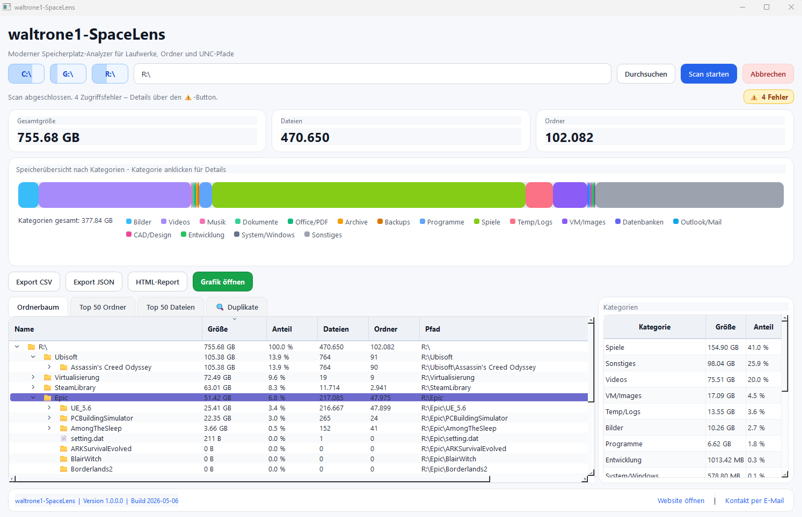
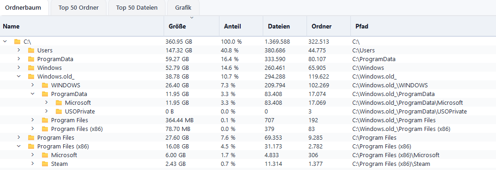
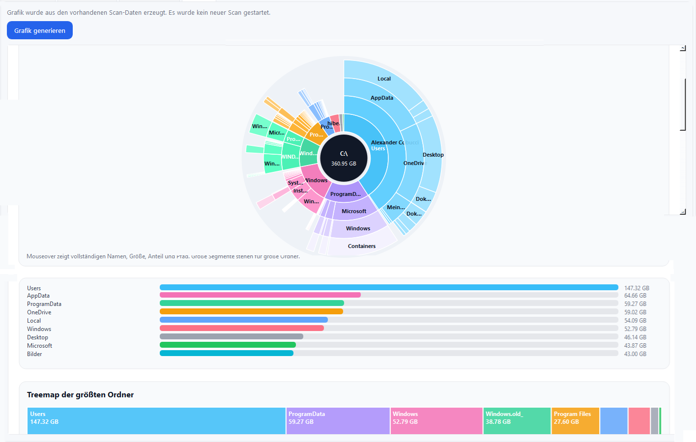
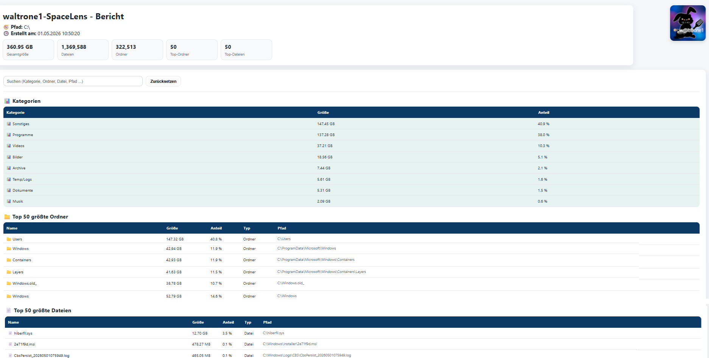

# waltrone1 SpaceLens

**waltrone1 SpaceLens** is a modern Windows storage analyzer for folders, drives and UNC paths.

It helps you understand where storage space is used by scanning a selected path and showing large folders, large files, file categories and possible duplicates in a clean desktop interface.

Part of the **WALTRONE Community Tools** collection.

---

## Screenshots

### Main dashboard



### Folder tree overview



### Graph view



### HTML report



---

## Overview

waltrone1 SpaceLens is designed for users who want a simple but powerful way to analyze storage usage on Windows systems.

The tool can scan local folders, drives and network paths, then display the results in multiple views.

It is useful for:

- finding large folders
- finding large files
- understanding storage usage by category
- checking old Windows folders
- analyzing external drives
- analyzing network paths
- preparing storage cleanup decisions
- creating HTML reports for documentation

---

## Features

- Modern Windows desktop interface
- Scan local folders, full drives and UNC network paths
- Quick drive buttons for common paths
- Show total size, file count and folder count
- Display the largest folders
- Display the largest files
- Folder tree view with size, percentage, file count, folder count and path
- File category overview
- Category detail view
- Duplicate file detection
- Export scan results as CSV
- Export scan results as JSON
- Generate an HTML report
- Open a larger graphical overview after a scan
- Graph view with visual folder usage overview
- Error summary for permission or access problems
- Suitable for local admin and IT support workflows

---

## File categories

waltrone1 SpaceLens groups files into useful categories, for example:

- Images
- Videos
- Music
- Documents
- Office / PDF
- Archives
- Backups
- Programs
- Games
- Temp / Logs
- VM / Images
- Databases
- Outlook / Mail
- CAD / Design
- Development
- System / Windows
- Other files

---

## Download

The easiest way to use waltrone1 SpaceLens is to download the prepared Windows release package.

GitHub releases:

```text
https://github.com/waltrone1/waltrone1-spacelens/releases
```

Optional support download:

```text
https://waltrone1.gumroad.com/
```

The tool is free to use. Gumroad is used for easier downloads and voluntary support.

---

## Requirements

For the prebuilt Windows release:

- Windows 10 or Windows 11
- No Python installation required

For running from source:

- Python 3.10 or newer
- PySide6

Python dependencies are listed in:

```text
requirements.txt
```

---

## Run from source

Clone or download the repository, then install the requirements:

```bash
pip install -r requirements.txt
```

Start the application with:

```bash
python run.py
```

---

## Build Windows EXE

A prepared PyInstaller build setup is included in the `py2exe` folder.

To build the Windows EXE:

1. Open the project folder on Windows
2. Go to the `py2exe` folder
3. Run:

```bat
build_exe_windows.bat
```

The script creates a virtual environment, installs the required packages and builds a single Windows EXE.

Expected output:

```text
py2exe/dist/waltrone1-SpaceLens.exe
```

---

## Project structure

```text
waltrone1-spacelens/
├─ README.md
├─ CHANGELOG.md
├─ LICENSE
├─ .gitignore
├─ requirements.txt
├─ run.py
├─ version_info.txt
├─ waltrone1-SpaceLens.ico
├─ screenshots/
│  ├─ spacelens-main-dashboard.png
│  ├─ spacelens-folder-tree.png
│  ├─ spacelens-graph-view.png
│  └─ spacelens-html-report.png
├─ docs/
├─ py2exe/
└─ waltrone1_spacelens/
```

---

## Repository contents

| Path | Description |
|---|---|
| `waltrone1_spacelens/` | Main application source code |
| `run.py` | Application start file |
| `requirements.txt` | Python dependencies |
| `py2exe/` | Windows EXE build files |
| `screenshots/` | Application screenshots |
| `docs/` | Additional documentation |
| `version_info.txt` | Windows version information for the EXE |
| `waltrone1-SpaceLens.ico` | Application icon |

---

## License

This project is provided under the **WALTRONE Community License**.

You are allowed to use the tool for personal, educational and internal administrative purposes.

You are not allowed to:

- sell this tool as your own product
- rebrand it as your own software
- commercially redistribute it without permission
- integrate it into a commercial product or paid service without permission

For details, see the `LICENSE` file.

---

## Disclaimer

This tool is provided as-is, without warranty of any kind.

waltrone1 SpaceLens is an analysis tool. It does not automatically delete files.

Always review scan results carefully before deleting, moving or changing files on your system.

---

## Links

GitHub repository:

```text
https://github.com/waltrone1/waltrone1-spacelens
```

GitHub profile:

```text
https://github.com/waltrone1
```

WALTRONE website:

```text
https://waltrone1.de/
```

---

## Author

Created by **WALTRONE**  
GitHub / Handle: **waltrone1**
